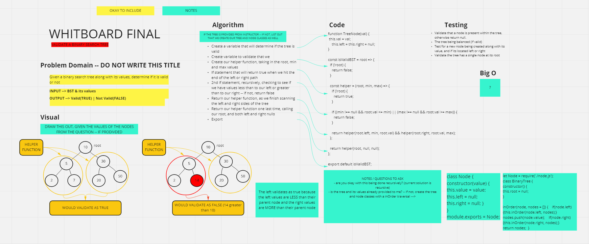

STUDY GUIDE FOR WHITEBOARD FINAL

### LL ODOMETER

###### REFS:
- https://www.geeksforgeeks.org/add-1-number-represented-linked-list/

 
 
### NEAREST NEIGHBOR

###### REFS:
- https://medium.com/journey-to-becoming-an-algoat/closest-value-in-a-bst-with-recursion-16bf90ad3bc2

 
 
### VALIDATE A BST

###### REFS:
- https://shareablecode.com/snippets/validate-binary-search-tree-javascript-solution-NaDs-AmBQ
- https://dev.to/akhilpokle/validate-a-binary-search-tree-1l1a
- https://perezchristian1012.medium.com/leetcode-js-algo-problem-validate-binary-search-tree-af82f547797d

###### QUESTIONS/EDGECASES FOR INTERVIEW:
- Should I assume the values of the tree are provided and that it's balanced? Or do I need to also create the tree and node classes?
- Do you prefer if I attempt this as iterative or recursive? Does it matter?

###### TESTING IDEAS: 
- Validate that a node is present within the tree, otherwise return null.
- The tree being balanced (if valid)
- Test for a new node being created along with its value, and if its located left or right
- Validate the tree has a single node at its root

###### IMG EX.

